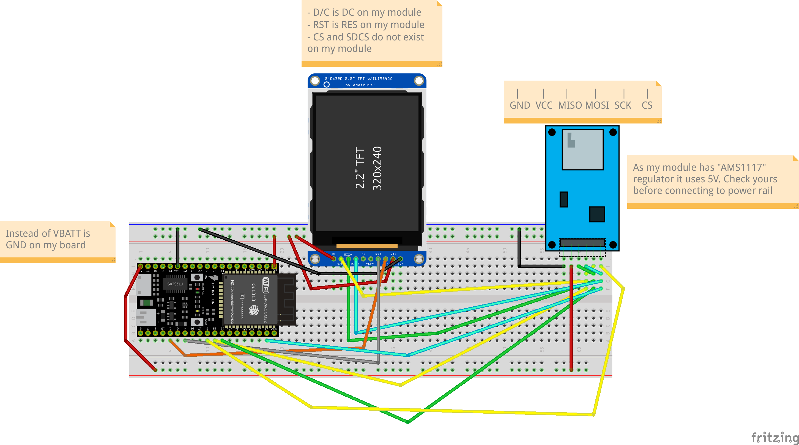

# ESP32 code and wiring example of TFT display and SD card

ESP32 code and wiring example of TFT display and SD card modules working together.

## Board

Install `esp32 by Espressif Systems` board from **Boards Manager**.

### My Board

`NodeMCU ESP-32S` (`NodeMCU-32s` in **Board selection** menu).

## Installed libraries

- [Adafruit ILI9341](https://github.com/adafruit/Adafruit_ILI9341) by Adafruit
- [Adafruit GFX Library](https://github.com/adafruit/Adafruit-GFX-Library) by Adafruit
- SD.h and SPI.h are installed in **Arduino IDE** by default.

## Schematic

